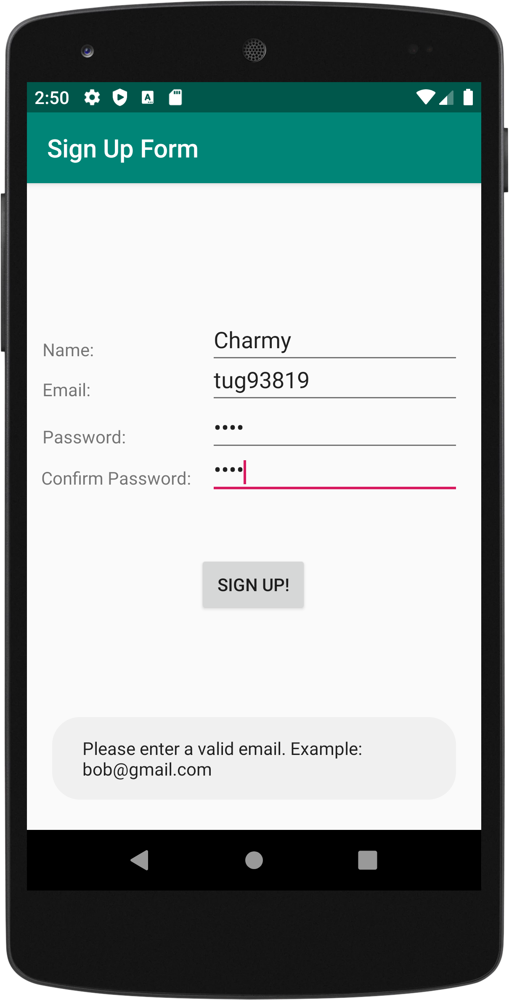
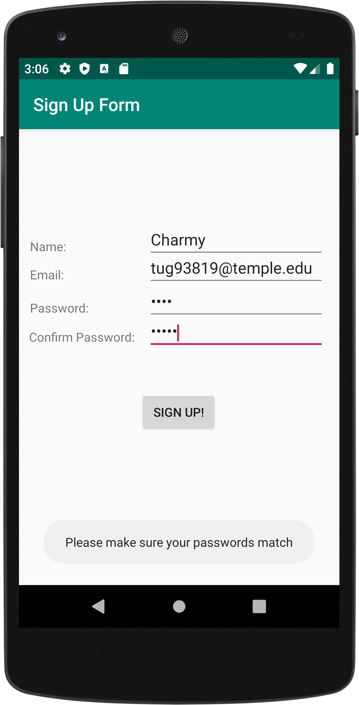
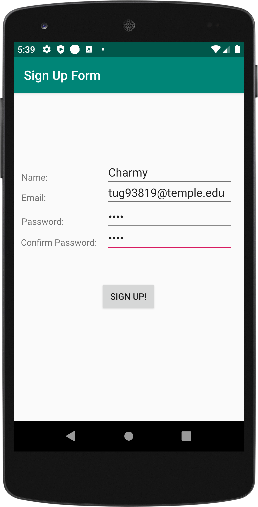
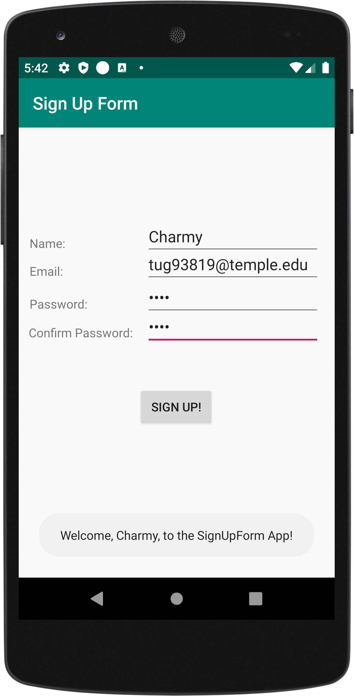

# Sign Up Form - CIS 3515

**Assignment 2**

This was the second assignment I worked on for my CIS 3515 - Introduction to Mobile Application Development course. 
The Android application collects a user’s name, email, a password, and a password confirmation. It also contains a Sign Up button. Afterwords it will display a message containing the user’s name, welcoming them to the app. e.g. “Welcome, Charmy, to the SignUpForm App”.

- The project is useful because it ensures that when a user signs up for something, each field in the form is validated 
to make sure items like name, email and password are entered in the correct format. The project can be used for anyone 
who would like to sign up for an event, for example university events or parties

- Application does many things to ensure each field has the correct input and is filled in. To start, if any of the boxes
in the form are left blank the user will get a toast message telling them which box they still need to fill in. Also when
the user enters their email the program will make sure the entered email is in the correct format. Then, when the user enters
their password and retypes it, the app will make sure that both of the entered passwords match. If they do not match the 
user will get a toast message telling them to fix it. Lastly, after everything in the form is filled in and in the correct 
format, the user's name will be displayed in a toast message welcoming them to the app. 
 

    

